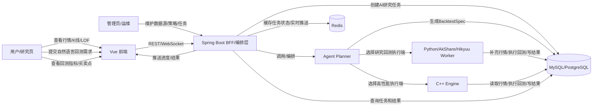
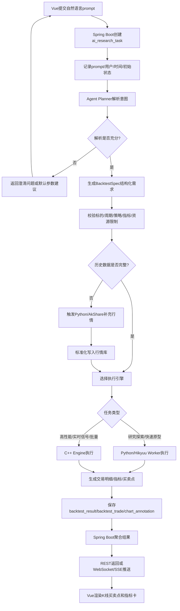
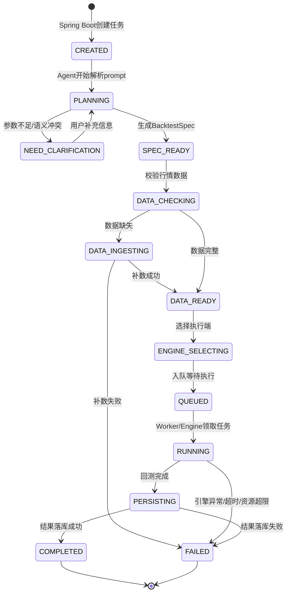

# AI Native 量化回测目标系统实施路线

> 目标：从当前已有 Java/C++ 行情与 MA 回测能力出发，先跑通最小可用 Demo 原型机，再逐步补齐 Vue 展示、Python/AkShare/Hikyuu Worker、Spring Boot 编排重构、Agent 工作流与可复现研究能力。

应用功能：
页面1：股票数据页面，页面格式例如名称为“页面示例”的图片。
页面2：股票策略回测页面，包含和ai对话的“对话框”，在对话框中输入自然语言,Agent进行回测显示结果在前端，包括买卖点均在k线上显示。

页面1详细前端样式（按照页面示例）：
页面分为 左侧主图表区域 + 右侧行情信息侧边栏，整体布局采用 左右分栏 + 多层绝对定位悬浮元素。
技术参考方案：外层容器 flex 左右布局；悬浮元素使用 absolute 定位；K 线图表推荐使用 ECharts/KLineChart/TradingView 实现 K 线副图多面板；视频字幕使用 DOM 浮层覆盖。
一、外层容器布局
plaintext
┌──────────────────────────────┬───────────────┐
│        主图表容器（左）          │ 右侧数据侧边栏   │
│                              │               │
│                              │               │
│        这里是技术指标           │  这里是分时k线   │
└──────────────────────────────┴───────────────┘
↓ 右下角悬浮主播窗口（覆盖在图表上层）
↓ 全局红色顶部标题文字（全屏悬浮Overlay）
↓ 底部粉色字幕悬浮条（图表底部Overlay）
1. 左侧主图表区域（占页面宽度～85%）
   内部垂直分为 4 个上下堆叠的子图面板（K 线主图 + 3 层副图），共享同一时间轴对齐
   从上至下顺序：
   面板 1：K 线主图（最高区域））
   内容：K 线蜡烛图 + 2 条平滑均线（红色快线、橄榄绿慢线）
   绘图元素：水平支撑压力灰色横线、竖线定位标记、价格刻度（右侧纵轴价格）
   顶部工具栏（图表内置）：复权、叠加、多股、统计、画线、F10、返回、自选等按钮（通达信风格表头）
   面板 2：成交量副图【量力而行 VOLUME】
   标题文字：量力而行 VOLUME:（当前数据接口获取的成交量）
   内容：红绿柱状成交量柱子
   无独立右侧刻度
   面板 3：MACD 副图【顺势而为】
   标题文字：顺势而为 DIF:（当前数据接口获取的DIF数据） DEA:（当前数据接口获取的DEA数据） MACD:（当前数据接口获取的MACD数据）
   绘图：DIF 红线、DEA 紫线、红绿 MACD 柱状图
   四个图表面板之间间距很小，时间轴横向对齐，鼠标联动十字光标（通达信标准 K 线交互）
2. 右侧侧边栏（固定宽度，占页面～15%）
   垂直布局，是个股 / ETF 盘口信息面板，自上而下：
   标题栏：（当前个股或ETF） 关闭叉按钮
   时间数据行：时间 2026/07/09(四)
   行情数值列表（两列：名称｜数值）
   plaintext（参考，实际根据行情数据接口获取）
   数值｜3.942
   开盘价｜3.904(0.96%)
   最高价｜4.048(4.68%)
   最低价｜3.841(-0.93%)
   收盘价｜4.040
   成交量｜1949万
   成交额｜76.5亿
   涨幅｜0.173(4.47%)
   振幅｜0.217(5.61%)
   换手率｜11.05%(参考)
   流通股｜21813
   五档盘口：买五 3.581
   涨跌停、高低、量比、市值、现量、内外盘
   IOPV、昨 PV、PV 涨、溢价率数据
   切换标签：创业板ETF易方达 / 创业板指（参考，实际根据选中的股票代码获取）
   内嵌小型分时走势图（紫色 + 蓝色曲线小 K 线窗口）
   交互需求（复刻通达信 K 线交互）
   所有 4 层图表横向时间轴同步；鼠标移动出现十字光标，所有面板光标同步对齐
   K 线支持蜡烛渲染、均线绘制、水平压力线、垂直标记线
   右侧侧边栏固定，不随图表滚动
   图表支持滚轮缩放 K 线、左右拖拽平移
   色彩规范（便于前端写样式）
   上涨 K 线 / 柱子：红色
   下跌 K 线 / 柱子：深绿色
   主图均线：红（快线）、橄榄绿（慢线）
   MACD：DIF 红、DEA 紫色
   压力支撑线：浅灰色
   顶部提示文字：红色字体带描边
   底部字幕：粉色背景

页面2：目前待定。
## 0. 总体原则

1. **先闭环，再优化**：优先让“输入股票和策略 -> 看到 K 线、回测指标、买卖点”跑通，而不是一开始追求完整量化平台。
2. **Spring Boot 保持唯一对外入口**：Vue 只调用 Spring Boot 的 REST/WebSocket/SSE，不直连数据库、AkShare、Hikyuu 或 C++。
3. **执行端可替换**：Python/Hikyuu Worker 与 C++ Engine 都实现统一任务输入和结果输出，前端不感知底层执行端。
4. **所有研究任务可复现**：保存 prompt、BacktestSpec、数据区间、策略参数、手续费/滑点、引擎版本、结果指标和图表标注。
5. **每个阶段都可展示**：每一阶段结束时都要有可演示页面或可调用 API，避免长期只做底层建设。

## 1. 阶段一：最小可用 Demo 原型机（MVP）— 详细设计

### 1.1 总体目标

跑通最短闭环链路，产出可演示的原型：

```text
Vue 输入股票代码/策略参数
  ↓
Spring Boot 调用现有行情/回测接口
  ↓
C++ MA 回测或现有 mock/数据库结果返回
  ↓
Vue 展示 K 线（含多面板技术指标）、MA 买卖点、基础回测指标
```

阶段1结束时，可以完整演示：打开浏览器 → 搜索股票 → 看到专业 K 线图（含成交量、MACD） + 右侧行情面板 → 执行 MA 回测 → K 线上标注买卖点 + 回测指标卡片。

同步搭建 `python-research-service` 目录骨架和 AkShare 脚本，为阶段2做准备。

#### Task 1.1：Vue 前端工程初始化

- [ ] `npm create vite@latest vue-trader-ui -- --template vue-ts`
- [ ] 安装依赖：`vue-router`, `pinia`, `element-plus`, `axios`, `klinecharts`, `unocss`
- [ ] 配置 `vite.config.ts`（路径别名 `@/`、代理或 CORS）
- [ ] 配置 `tsconfig.json`（路径别名、严格模式）
- [ ] 创建目录骨架：`router/`、`stores/`、`api/`、`types/`、`composables/`、`views/`、`components/`、`styles/`
- [ ] `main.ts`：注册 router + pinia + Element Plus
- [ ] `App.vue`：最小 `<router-view>` 容器
- [ ] `.env.development`：`VITE_API_BASE_URL=http://localhost:8081`

**验收点**：`npm run dev` 启动正常，浏览器可访问空白页面。

#### Task 1.2：路由 + 页面骨架 + 通用组件

- [ ] 配置两条路由（`/stock/:symbol`、`/ai-backtest`）
- [ ] 创建 `StockDetailPage.vue`（先只放 `<h1>Stock: {{ symbol }}</h1>` 验证路由参数）
- [ ] 创建 `AiBacktestPage.vue`（骨架布局 + 空状态占位）
- [ ] 创建 `StockSearchInput.vue` — 输入框 + 下拉建议列表（先用前端静态股票列表）
- [ ] 创建 `LoadingOverlay.vue` — 半透明遮罩 + `el-icon-loading`
- [ ] 创建 `ErrorState.vue` — 错误图标 + 提示文字 + 重试按钮

**验收点**：`/stock/sh600519` 显示页面标题，`/ai-backtest` 显示骨架布局。

#### Task 1.3：API 层 + TS 类型 + Pinia Store 骨架

- [ ] 定义 TS 类型：`types/market.ts`（`MarketQuote`、`KLineData`）、`types/backtest.ts`（`MaBacktestRequest`、`MaBacktestResponse`、`BacktestSignal`）
- [ ] 创建 `api/client.ts`（Axios 实例 + 拦截器）
- [ ] 创建 `api/market.ts`、`api/backtest.ts`
- [ ] 创建 `stores/market.ts`（state + fetch actions）
- [ ] 创建 `stores/backtest.ts`（state + execute/query actions）
- [ ] 创建 `stores/ui.ts`

**验收点**：各 store 可 import，TypeScript 编译无错误。

#### Task 1.4：Spring Boot 新增历史 K 线查询接口

- [ ] 新建 `market/history/controller/HistoryQueryController.java`
  - 实现 `GET /api/market/history/kline`
  - 参数校验：`symbol` 必填且格式校验（`sh|sz|bj` + 6位数字）
  - 日期范围校验：`endDate > startDate`，跨度不超过 10 年
  - `days` 默认 90，上限 365
- [ ] 新建 `market/history/service/HistoryQueryService.java`
  - 调用已有 `MySqlStockDailyKlineRepository`
  - 新封装方法 `findBySymbolAndDateRange(symbol, startDate, endDate)`
- [ ] DTO：新建 `dto/KLineDataPoint.java`
  - 字段：`tradeDate`、`open`、`high`、`low`、`close`、`volume`、`turnover`

**验收点**：
```bash
curl “http://localhost:8081/api/market/history/kline?symbol=sh600519&days=30”
# 返回 200 + 近 30 天日K JSON 数组
```

#### Task 1.5：KLineChart 集成 + K 线主图渲染

- [ ] 封装 `composables/useKLineChart.ts`
  - `initChart(containerRef)` → 初始化 KLineChart 实例
  - `updateData(klineData: KLineData[])` → `applyNewData()`
  - `addIndicator(name, paneId)` → `createIndicator()`
  - `disposeChart()` → `dispose()`
  - 监听窗口 resize 自动重绘
- [ ] 创建 `KLineChartPanel.vue`
  - 绑定 div 容器
  - `onMounted` 中 `initChart`
  - `watch(klineData)` 中 `updateData`
  - `onUnmounted` 中 `disposeChart`
- [ ] 配置 KLineChart 主题样式（上涨红 / 下跌深绿 / 均线颜色）
- [ ] 渲染 3 个面板：
  - Pane 0：K 线蜡烛图 + MA5（#EF5350 红线）+ MA20（#8B8B00 橄榄绿）
  - Pane 1：成交量 VOLUME（红绿柱）
  - Pane 2：MACD（DIF 红线、DEA 紫线、红绿柱）

**验收点**：访问 `/stock/sh600519`，K 线图、成交量、MACD 三个面板正确渲染，颜色符合规范。

#### Task 1.6：右侧行情侧边栏

- [ ] 创建 `SidePanel.vue`（固定宽度 15%，不随图表滚动）
- [ ] 创建 `StockInfoHeader.vue` — 股票代码 + 中文名称 + `el-icon-close`
- [ ] 创建 `QuoteDataTable.vue` — 两列布局（名称｜数值），显示：
  - 最新价、开盘价、最高价、最低价、收盘价
  - 成交量、成交额、涨幅、振幅、换手率、流通股
- [ ] 创建 `FiveLevelQuotes.vue` — 五档盘口（阶段1用静态占位数据）
- [ ] 创建 `MiniTimeChart.vue` — 迷你分时走势图（阶段1用静态占位，阶段6替换为真实数据）

**验收点**：侧边栏显示实时行情数据，与 K 线图左右分栏布局正确。

#### Task 1.7：通达信风格 Overlay 元素

- [ ] 创建 `TopTitle.vue` — 全局红色顶部标题文字（`position: absolute; top: 0; left: 50%`）
  - 文字内容：当前股票名称 + 代码，红色字体带黑色描边
- [ ] 创建 `BottomSubtitle.vue` — 底部粉色字幕悬浮条
  - `position: absolute; bottom: 0; width: 100%`，粉色背景，居中滚动文字
- [ ] 创建 `ChartToolbar.vue` — 顶部工具栏按钮组
  - 按钮：复权、叠加、多股、统计、画线、F10、返回、自选（阶段1只做 UI 占位，点击事件后续实现）

**验收点**：顶部标题和底部字幕正确叠加在 K 线图层上方，不遮挡关键数据。

#### Task 1.8：回测控制栏 + 买卖点标注

- [ ] 创建 `BacktestControlBar.vue`
  - 策略类型下拉：`MA_CROSS_5`（阶段1 固定）
  - 日期范围选择器（el-date-picker，默认近一年）
  - “执行回测”按钮（el-button，loading 状态绑定 `backtestStore.executing`）
- [ ] 连接 `backtestStore.executeMaBacktest()`
  - 调用 `POST /api/backtest/ma`（复用现有接口）
  - 成功后结果存 `backtestStore.result`
- [ ] 在 `KLineChartPanel.vue` 中监听 `backtestStore.result`
  - 收到信号后，在主图上标注买卖点：
    - `crossUpDates` → 向上箭头绿色图标（买入）
    - `crossDownDates` → 向下箭头红色图标（卖出）
  - 使用 KLineChart `createIndicator` 的 `mark` 数据或 `overrideIndicator` 实现

**验收点**：
- 点击”执行回测”→ 按钮 loading → 结果返回
- K 线图出现买卖点箭头标注
- 指标卡片显示收益率/胜率/交易次数

#### Task 1.9：股票搜索切换 + 路由联动

- [ ] 创建 `StockSearchInput.vue`（完善版）
  - 输入框支持直接输入股票代码（如 `sh600519`、`sz000001`）
  - 下拉列表展示匹配股票（阶段1 用前端静态列表：`sh600519 贵州茅台`、`sz000001 平安银行`、`sh000001 上证指数`）
  - 选中后调用 `router.replace(/stock/${symbol})`
- [ ] `StockDetailPage.vue` 中 `watch(route.params.symbol)`
  - symbol 变化 → 重新加载行情 + K 线数据
  - 切换时重置 backtest result

**验收点**：搜索框输入 `sh600519` → 回车 → URL 变成 `/stock/sh600519` → 数据自动刷新。

#### Task 1.10：Vue ↔ Spring Boot CORS 配置 + 联调

- [ ] Spring Boot 配置 CORS（允许 `http://localhost:5173`）
  - 新建 `config/WebMvcConfig.java` 或 `config/CorsConfig.java`
  - 允许 origin、methods、headers、credentials
- [ ] `api/client.ts` 配置 baseURL 和 timeout
- [ ] 端到端验证：
  - 前端请求 `GET /api/market/quotes?symbols=sh600519` → 返回数据
  - 前端请求 `GET /api/market/history/kline?symbol=sh600519&days=90` → 返回 K 线
  - 前端请求 `POST /api/backtest/ma` → 返回回测结果

**验收点**：前端不出现 CORS 报错，所有 API 调用均返回 200。

#### Task 1.11：Python/AkShare 服务骨架 + 单脚本验证

- [ ] 创建 `python-research-service/` 目录骨架
- [ ] 编写 `requirements.txt`：`akshare>=1.13.0, pymysql, sqlalchemy, pandas`
- [ ] 编写 `config/settings.py`（读取 `.env` 或命令行参数，含 DB 连接信息）
- [ ] 编写 `src/common/models.py`（`DailyKLine` dataclass）
- [ ] 编写 `src/common/retry.py`（指数退避装饰器，最多 3 次）
- [ ] 编写 `src/akshare_ingest/fetcher.py`
  - 封装 `akshare.stock_zh_a_hist(symbol=”600519”, period=”daily”, start_date=”...”, end_date=”...”, adjust=”qfq”)`
  - 处理 AkShare 特有的 symbol 格式转换（`sh600519` ↔ `600519` 市场前缀映射）
- [ ] 编写 `src/akshare_ingest/transformer.py`
  - AkShare 字段 → `DailyKLine` 统一 schema
  - AkShare 列名映射：`日期→trade_date, 开盘→open, 收盘→close, 最高→high, 最低→low, 成交量→volume, 成交额→turnover`
- [ ] 编写 `src/akshare_ingest/writer.py`
  - 连接 MySQL（复用 `invest_stock_system` 库）
  - 批量 `INSERT ... ON DUPLICATE KEY UPDATE`
  - 记录写入行数 + 耗时日志
- [ ] 编写 `scripts/ingest_single.py`
  - 命令行参数：`--symbol`、`--months`、`--adjust-type`
  - 调用 `fetcher → transformer → writer` 链路
- [ ] 手动验证：
  ```bash
  cd python-research-service
  pip install -r requirements.txt
  python scripts/ingest_single.py --symbol sh600519 --months 3
  # 验证：MySQL stock_daily_kline 表中出现 sh600519 近 3 个月数据
  ```

**验收点**：脚本成功执行，MySQL 中有新增/更新的 K 线数据，`source=akshare`。

#### Task 1.12：启动脚本 + README + 演示路线

- [ ] 编写 `vue-trader-ui/package.json` 中的 `scripts`
  - `dev`: `vite --port 5173`
  - `build`: `vue-tsc && vite build`
  - `preview`: `vite preview`
- [ ] 编写项目根目录 `README.md`（启动指南）
  ```markdown
  ## 本地启动
  1. 启动 C++ 引擎: cd cpp-analysis-service && ./start.sh (端口 8080)
  2. 启动 Spring Boot: cd stock_invest_backend && mvn spring-boot:run (端口 8081)
  3. 启动前端: cd vue-trader-ui && npm install && npm run dev (端口 5173)
  4. 打开浏览器: http://localhost:5173/stock/sh600519
  ```
- [ ] 编写演示脚本（Demo 顺序）：
  1. 打开 `http://localhost:5173` → 自动跳转贵州茅台 K 线图
  2. 展示 K 线图 3 个面板（蜡烛图 + 成交量 + MACD）
  3. 指右侧行情面板（最新价、涨跌幅、成交量等）
  4. 搜索框输入 `sz000001` → 切换到平安银行
  5. 点击”执行 MA 回测” → 展示 K 线上的买卖点 B/S 标注
  6. 指指标卡片（收益率/胜率/交易次数）

## 2. 阶段二：Python/AkShare 数据采集 Worker — 详细设计

### 2.1 总体目标

以 AkShare 为主要采集通道补齐历史行情，覆盖 A 股日 K、指数、LOF/基金三类品种，统一 schema 写入现有 `stock_daily_kline`。Spring Boot 增加"数据完整性检查 + 触发补数"能力，让阶段一 K 线图与 MA 回测在任意历史区间都能读到完整数据。

```text
Spring Boot 校验回测区间数据完整性
  ↓
发现数据缺口 → 生成补数任务
  ↓
调用 Python Worker (CLI 或 HTTP)
  ↓
AkShare 拉取 → 转换为统一 schema → 幂等 upsert MySQL
  ↓
Spring Boot 复检通过 → K 线图 / MA 回测可读到新数据
```

阶段 2 结束时，可以完整演示：在前端查询一只从未采集过的股票 → 后端检测出数据缺口 → 自动触发 Python 补数 → 数据回填成功 → 前端 K 线图与 MA 回测立即出结果。

#### Task 2.1：项目骨架完善与依赖锁定

- [ ] 完善 `python-research-service/` 目录结构：`config/`、`src/common/`、`src/akshare_ingest/`、`src/result_writer/`、`scripts/`、`tests/`、`logs/`（logs 目录加入 `.gitignore`）
- [ ] `requirements.txt` 固定版本：`akshare>=1.13.0`、`pandas>=2.0`、`pymysql>=1.1`、`sqlalchemy>=2.0`、`python-dotenv>=1.0`、`tenacity>=8.2`、`loguru>=0.7`、`pytest>=7.4`
- [ ] `.env.example` 定义环境变量占位：
  - `DB_HOST=127.0.0.1`
  - `DB_PORT=3306`
  - `DB_NAME=invest_stock_system`
  - `DB_USER=root`
  - `DB_PASSWORD=`
  - `AKSHARE_TIMEOUT_SECONDS=30`
  - `INGEST_LOG_LEVEL=INFO`
  - `INGEST_LOG_DIR=./logs`
- [ ] `pyproject.toml` 或 `setup.cfg`：声明 `src/` 为 package root，方便 `python -m` 调用
- [ ] `README.md` 补充：环境准备、依赖安装、脚本调用方式、常见错误

**验收点**：`pip install -r requirements.txt` 一次装完不报错；`python -c "import akshare; import pymysql; import sqlalchemy; import loguru"` 全部导入成功。

#### Task 2.2：配置层 + 日志基础设施

- [ ] 完善 `config/settings.py`：
  - 从 `.env` 读取全部配置（`python-dotenv`）
  - 提供 `Settings` dataclass，字段：`db_url`（拼装出 `mysql+pymysql://...`）、`akshare_timeout_seconds`、`log_level`、`log_dir`
  - 提供 `get_settings()` 缓存单例
- [ ] 新建 `src/common/logger.py`：
  - 基于 loguru 封装 `get_logger(name)`
  - 输出格式统一带 `requestId`（无则 `-`）、`symbol`、`stage`、`latencyMs`
  - 文件切分：按天滚动 + 保留 14 天
- [ ] 新建 `src/common/errors.py`：定义异常类
  - `AkshareUpstreamError`（外部接口失败，可重试）
  - `TransformError`（字段映射失败，不可重试）
  - `WriterError`（数据库写入失败，可重试）
  - `NoDataError`（AkShare 返回空，非错误但需上报）

**验收点**：`from config.settings import get_settings; print(get_settings().db_url)` 正确输出脱敏后的连接串；日志文件按预期路径落盘。

#### Task 2.3：通用 models 与 retry 装饰器

- [ ] 完善 `src/common/models.py`：
  - `DailyKLine` dataclass 字段：`symbol`、`trade_date`（`datetime.date`）、`open`、`high`、`low`、`close`、`volume`、`turnover`、`source`（`"akshare"`）、`adjust_type`（`qfq|hfq|none`）
  - 提供 `to_row()` 返回可直接喂给 `executemany` 的 tuple
  - 提供 `SymbolType` 枚举：`A_STOCK`、`INDEX`、`LOF_FUND`
- [ ] 完善 `src/common/retry.py`（基于 `tenacity`）：
  - `@akshare_retry`：最多 3 次，指数退避（1s → 2s → 4s），仅在 `AkshareUpstreamError` / 网络异常时重试
  - `@db_retry`：最多 2 次，固定退避 500ms，仅在 `WriterError` 时重试
  - 每次重试打印 warning 级日志，含 `attempt/max_attempts/exception`
- [ ] 新建 `src/common/symbol_utils.py`：
  - `parse_symbol(symbol: str) -> (SymbolType, market_prefix, pure_code)`
  - 支持 `sh600519 ↔ 600519`、`sz000001 ↔ 000001`、`sh000001` 判定为指数
  - LOF 代码前缀映射（例如 `sz161129 → 深交所LOF`）

**验收点**：单元测试 `tests/test_symbol_utils.py`、`tests/test_retry.py` 全部通过；模拟 AkShare 抛 `ConnectionError` 时装饰器按预期重试 3 次。

#### Task 2.4：数据库迁移脚本 — 扩展 stock_daily_kline

- [ ] 新建 `stock_invest_backend/docs/sql/004_extend_stock_daily_kline.sql`：
  - 新增列 `source VARCHAR(16) NOT NULL DEFAULT 'unknown'`
  - 新增列 `adjust_type VARCHAR(8) NOT NULL DEFAULT 'none'`
  - 新增列 `updated_at DATETIME NOT NULL DEFAULT CURRENT_TIMESTAMP ON UPDATE CURRENT_TIMESTAMP`
  - 唯一键升级：`UNIQUE KEY uk_symbol_date_adjust (symbol, trade_date, adjust_type)`（避免不同复权类型互相覆盖）
- [ ] 兼容性检查：确认 Java 侧 `MySqlStockDailyKlineRepository` 的 `upsert` SQL 会带上新字段（默认值让旧 Java 写入不报错）
- [ ] 编写回滚脚本 `004_extend_stock_daily_kline_rollback.sql`

**验收点**：在测试库执行迁移脚本后，`SHOW CREATE TABLE stock_daily_kline` 输出包含三个新列 + 新唯一键；旧的 Java `POST /api/market/history/ingest` 写入依旧成功。

#### Task 2.5：AkShare fetcher — 三品种数据采集

- [ ] 完善 `src/akshare_ingest/fetcher.py`：
  - `fetch_a_stock_daily(symbol, start_date, end_date, adjust_type)` → 调用 `ak.stock_zh_a_hist`
  - `fetch_index_daily(symbol, start_date, end_date)` → 调用 `ak.stock_zh_index_daily_em`
  - `fetch_lof_daily(symbol, start_date, end_date)` → 调用 `ak.fund_lof_hist_em`
  - 统一入口 `fetch(symbol, start_date, end_date, adjust_type)`：根据 `parse_symbol` 结果分派
- [ ] 应用 `@akshare_retry` 装饰器
- [ ] 空数据处理：AkShare 返回空 DataFrame 时抛 `NoDataError`（供上层决定是否算作失败）
- [ ] 记录采集日志：`stage=FETCH_START/FETCH_END`，包含品种类型、请求区间、返回行数、耗时

**验收点**：
```bash
python -c "from src.akshare_ingest.fetcher import fetch; import datetime; df = fetch('sh600519', datetime.date(2026,1,1), datetime.date(2026,3,1), 'qfq'); print(df.shape)"
# 输出非空 DataFrame，列包含日期/开盘/收盘/最高/最低/成交量/成交额
```

#### Task 2.6：transformer — 字段映射到统一 schema

- [ ] 完善 `src/akshare_ingest/transformer.py`：
  - `transform_a_stock(df, symbol, adjust_type) -> list[DailyKLine]`
    - 列名映射：`日期→trade_date`、`开盘→open`、`收盘→close`、`最高→high`、`最低→low`、`成交量→volume`、`成交额→turnover`
  - `transform_index(df, symbol) -> list[DailyKLine]`：AkShare 指数接口列名为英文，需要单独映射
  - `transform_lof(df, symbol) -> list[DailyKLine]`：LOF 接口字段与 A 股略有差异
  - 统一入口 `transform(df, symbol, symbol_type, adjust_type)`
- [ ] 数据清洗：
  - 剔除全为 NaN 的行
  - `trade_date` 强制转 `datetime.date`
  - `volume` / `turnover` 转 `int64` / `Decimal(20,2)` 前处理溢出
  - 缺失 `turnover` 的品种（如部分指数）用 0 占位并打 warning
- [ ] 异常处理：字段缺失或类型不匹配时抛 `TransformError`，附带具体列名

**验收点**：单元测试 `tests/test_transformer.py` 覆盖 A 股/指数/LOF 三类样例 DataFrame，全部产出合法 `DailyKLine` 列表；异常样例（缺列/脏数据）抛 `TransformError`。

#### Task 2.7：writer — 批量幂等 upsert

- [ ] 完善 `src/akshare_ingest/writer.py`：
  - 使用 SQLAlchemy Core（不引入 ORM），复用连接池
  - `write_daily_kline(records: list[DailyKLine]) -> WriteResult`
    - SQL: `INSERT INTO stock_daily_kline (...) VALUES (...) ON DUPLICATE KEY UPDATE open=VALUES(open), high=VALUES(high), ...`
    - 分批提交（默认 500 行/批），避免单事务过大
    - 返回 `WriteResult(inserted_or_updated, batches, elapsed_ms)`
- [ ] 应用 `@db_retry` 装饰器
- [ ] 日志：`stage=WRITE_START/WRITE_END`，含 `symbol、rows、batches、elapsedMs`
- [ ] 空列表短路：`records == []` 直接返回 `WriteResult(0, 0, 0)`，不发起数据库连接

**验收点**：造 10 条测试数据两次调用 `write_daily_kline`，MySQL 中该 symbol + date 组合仍只有 10 行；第二次写入 `updated_at` 变化验证 upsert 生效。

#### Task 2.8：单标的采集脚本 ingest_single.py

- [ ] 完善 `scripts/ingest_single.py`：
  - CLI 参数（argparse）：`--symbol`（必填）、`--months`（与 `--start-date/--end-date` 二选一）、`--start-date`、`--end-date`、`--adjust-type`（默认 `qfq`）、`--request-id`（可选，用于串联日志）
  - 流程：`parse_symbol → fetch → transform → write`
  - 出错时写入错误日志并 `sys.exit(1)`，成功时打印 `WriteResult` JSON 到 stdout
- [ ] 结构化输出（供 Spring Boot 解析）：
  ```json
  {"requestId":"...","symbol":"sh600519","rows":66,"batches":1,"elapsedMs":1234,"status":"OK"}
  ```
- [ ] 失败输出：
  ```json
  {"requestId":"...","symbol":"sh600519","status":"FAIL","errorCode":"AKSHARE_UPSTREAM","message":"..."}
  ```

**验收点**：
```bash
python scripts/ingest_single.py --symbol sh600519 --months 3 --adjust-type qfq --request-id ingest-20260724-0001
# MySQL 出现 sh600519 近 3 个月 qfq 数据，source=akshare
# stdout 打印一行 status=OK 的 JSON 摘要
```

#### Task 2.9：批量采集脚本 ingest_batch.py

- [ ] 完善 `scripts/ingest_batch.py`：
  - CLI 参数：`--symbols`（逗号分隔或文件路径 `@symbols.txt`）、`--months`、`--adjust-type`、`--parallel`（默认 4，最大 8）
  - 使用 `concurrent.futures.ThreadPoolExecutor` 并发拉取（受 AkShare 速率限制，`--parallel` 不建议超过 8）
  - 汇总输出：成功数、失败数、每只 symbol 的 `WriteResult`
- [ ] 失败隔离：单只 symbol 失败不影响其他，最终 exit code：全成功=0，部分失败=2，全失败=1
- [ ] 输出结构化 JSON（stdout）：
  ```json
  {"total":10,"succeeded":9,"failed":1,"failedSymbols":["sz000999"],"elapsedMs":12345}
  ```

**验收点**：`python scripts/ingest_batch.py --symbols sh600519,sz000001,sh000001 --months 6 --parallel 3` 三只标的均写入成功；将其中一只故意改成非法代码，验证失败隔离与 exit code=2。

#### Task 2.10：Spring Boot 数据完整性检查服务

- [ ] 新建 `market/history/service/HistoryDataCompletenessService.java`：
  - `checkCompleteness(symbol, startDate, endDate, adjustType) -> CompletenessResult`
  - 逻辑：查询 `stock_daily_kline` 该区间的 `MIN(trade_date)/MAX(trade_date)/COUNT(*)`，与预期交易日数量对比
  - 复用简版交易日历（阶段一已内置的工作日 + 已知节假日）估算预期条数
  - 返回：`{complete: bool, missingRanges: [[start,end], ...], expected: N, actual: M}`
- [ ] 新建 DTO：`market/history/dto/CompletenessResult.java`
- [ ] 新建接口 `GET /api/market/history/completeness`：
  - Query：`symbol`、`startDate`、`endDate`、`adjustType`（默认 `qfq`）
  - 返回 `CompletenessResult`

**验收点**：
```bash
curl "http://localhost:8081/api/market/history/completeness?symbol=sh600519&startDate=2020-01-01&endDate=2026-07-01"
# 返回 {complete: false, missingRanges: [["2020-01-01","2023-06-30"]], expected: 1580, actual: 750}
```

#### Task 2.11：Spring Boot 触发 Python 补数任务

- [ ] 新建配置 `python.research.service.command-base`（默认 `python`）、`python.research.service.working-dir`（默认 `../python-research-service`）、`python.research.service.timeout-seconds`（默认 300）
- [ ] 新建 `market/history/service/PythonIngestInvoker.java`：
  - 通过 `ProcessBuilder` 调用 `python scripts/ingest_single.py`
  - 传参：`--symbol、--start-date、--end-date、--adjust-type、--request-id`
  - 捕获 stdout 最后一行 JSON，反序列化为 `IngestResult`
  - 全程超时控制 + 进程未退出时 `Process.destroyForcibly()`
- [ ] 新建接口 `POST /api/market/history/backfill`：
  - Body：`{"symbol":"sh600519","startDate":"2020-01-01","endDate":"2026-07-01","adjustType":"qfq"}`
  - 流程：先跑 `HistoryDataCompletenessService` → 有缺口则调用 `PythonIngestInvoker`（仅补 `missingRanges` 覆盖的区间）→ 再复检
  - 返回：`{status: "OK|PARTIAL|FAIL", ingestResults: [...], completenessAfter: {...}}`
- [ ] 日志：`[requestId] BACKFILL_START/BACKFILL_END`，含缺口数、补数耗时、命中率

**验收点**：
```bash
curl -X POST "http://localhost:8081/api/market/history/backfill" \
  -H "Content-Type: application/json" \
  -d '{"symbol":"sh600519","startDate":"2024-01-01","endDate":"2026-07-01","adjustType":"qfq"}'
# 返回 status=OK，completenessAfter.complete=true
# Python 侧日志文件出现对应 requestId 的完整链路
```

#### Task 2.12：采集监控 + 阶段 2 演示脚本

- [ ] 新建 `python-research-service/scripts/health_check.py`：
  - 检查项：MySQL 可连通、AkShare 拉取 `sh000001` 最近 1 天数据可返回、日志目录可写
  - 输出 JSON：`{"db":"OK","akshare":"OK","logDir":"OK"}`
- [ ] Spring Boot 新增接口 `GET /api/market/history/ingest-health`：包装调用上述脚本，用于运维巡检
- [ ] 编写阶段 2 演示脚本（写入 `python-research-service/README.md` 与项目根 `README.md`）：
  1. 前端搜索一只本地无历史数据的股票（如 `sh601398`）→ 展示"数据未采集"空态
  2. 调用 `GET /api/market/history/completeness` → 展示 `complete=false`
  3. 调用 `POST /api/market/history/backfill` → 展示 Python Worker 日志实时输出
  4. 补数成功后刷新前端 → K 线图正常渲染
  5. 点击"执行 MA 回测" → 使用刚补齐的数据得出结果

**验收点**：从"空数据"到"K 线 + 回测就绪"整个链路无需人工干预 SQL；`ingest-health` 接口在正常环境下三项均 `OK`。

### 2.13 阶段 2 总验收标准

- 三类品种（A 股 / 指数 / LOF）均可通过 CLI 单独补数，字段 schema 一致
- Spring Boot 检测到数据缺口时能自动触发 Python 补数，端到端不超过配置的超时时间
- 所有采集记录带 `source=akshare` 与 `adjust_type`，MySQL 中 `(symbol, trade_date, adjust_type)` 唯一
- Python Worker 与 Spring Boot 各自的日志可通过 `requestId` 串联
- AkShare 单次失败可自动重试 3 次，批量任务单失败不阻塞其他标的
- 阶段一已有的 K 线查询接口和 MA 回测接口无需改动即可读到新数据

### 2.14 阶段 2 补充实现
(1)前端输入框输入任意一个股票代码，都能正常显示出数据。
用户输入 sh600519
│
├─ ① GET /api/market/history/kline?symbol=sh600519&days=90
│    ├─ 返回非空数组 → 直接画 K 线，结束
│    └─ 返回空数组 [] → 进入 ②
│
├─ ② GET /api/market/history/completeness
│        ?symbol=sh600519&startDate=<今天-4个月>&endDate=<今天>
│    ├─ complete=true 但 kline 空 → 说明是别的问题（提示错误）
│    └─ complete=false → 进入 ③（前端展示 loading 遮罩"正在拉取历史数据…"）
│
├─ ③ POST /api/market/history/backfill
│       Body: { symbol, startDate, endDate, adjustType:"qfq" }
│    ├─ status=OK   → 进入 ④
│    ├─ status=PARTIAL → 提示"部分数据获取失败"，仍进入 ④ 画能画的
│    └─ status=FAIL → 提示错误（AkShare 上游异常等）
│
└─ ④ 重新调用 ① 拿到数据 → 画 K 线

(2)小修改：a.将所有股票都改成红涨绿跌，符合A股标准
b.默认获取1年（365天）k线数据，而非4个月

(3)更新最新原型机demo：
加上原来后端编写的ai投资建议模块(AI tool calling)的功能， 
前端左下角：MA回测选择，时间段选择，执行回测后方再加上一个按钮“生成AI投资分析报告”,执行相应的后端逻辑，
在生成回测结果相同的位置显示AI投资报告。
对于该编程的思路主要是：

(4)微调：回测结果例如：回测结果（MA_CROSS_5）
收益率
--
胜率
46.2%
交易次数
26
盈利信号
12
数据天数
233
执行引擎
cpp-backtest-mysql

其中，标题：回测结果（MA_CROSS_5）字体显示改为白色。补充收益率的显示实现：
采用的方案是前端本地算，在**阶段三**再将其补充为后端补充接口。目前只进行原型机开发。
以及买入，卖出信号在前端页面上的显示。

测试数据正常，但是以及买入，卖出信号在前端页面上的显示仍有问题，我的要求是在前端显示的k线图中，对于单一的k线显示买入或卖出信号，而目前
前端k线上没有显示，可能是什么原因？

经过排查发现原因：
目前项目使用的是 KLineChart v5，不是 v8/v9。

KLineChart v5 的 API 完全不同

- v5 用的是 createShape()，没有 createOverlay()
- v5 的 createShape 签名和我代码里写的都不一样：
    - v5：chart.createShape(name: string, points?: Point[], styles?) — name 是内置形状名（"line"/"segment"/"rayLine"/"arrow"），并没有 simpleAnnotation 这个
      name
    - v9：chart.createOverlay({ name: 'simpleAnnotation', ... }) — 我错按 v9 写的

所以我代码里两个分支都对不上：
- createOverlay — v5 根本没这方法，?.bind(c) 得到 undefined，直接跳过
- createShape — v5 有，但传参格式是 chart.createShape('name', [{timestamp, value}])，我传成了 ({ name, text }, { id, points })
  的对象结构，被忽略或抛错在内部 catch 掉

结果：一个 B/S 都画不出来，也不报错。

修改完成后，遇到了k线数据及显示异常的问题，在D:\stock-invest-system\stock_invest_backend\docs\k线异常问题.png中是系统的问题图片，
包括回测也收到异常数据。原因：多个数据源拉取数据显示在同一前端页面
## 3. 阶段三：Python/Hikyuu 回测 Worker

### 3.1 目标

复用 Hikyuu（电脑C:\Users\112\Desktop\hikyuu-master的量化python库）/Python 快速实现更多策略回测能力，减少早期在 C++ 端重复造轮子。
特别注意：Hikyuu的使用教程在网址https://hikyuu.readthedocs.io/zh-cn/latest/install.html中，你可以参考。
### 3.2 任务清单

- 定义统一 `BacktestSpec` JSON 作为 Python/Hikyuu 和 C++ 的共同输入。
- 定义统一 `BacktestResult` JSON 作为所有执行端的共同输出。
- 新增 Python/Hikyuu Worker：读取任务、加载行情、执行策略、计算指标、生成交易明细和图表标注。
- 支持至少一个 Hikyuu 策略示例，例如 MA 双均线策略。
- 将结果写入 `backtest_result`、`backtest_trade`、`chart_annotation`。
- Spring Boot 增加执行端路由：`engine=AUTO|CPP|PYTHON_HIKYUU`。

### 3.3 验收标准

- 同一个 `BacktestSpec` 可以选择 C++ 或 Python/Hikyuu 执行。
- 前端无需修改即可展示不同执行端返回的结果。
- 至少支持年化收益、最大回撤、夏普比率、胜率、交易次数。

## 4. 阶段四：Spring Boot 重构为任务编排中枢

### 4.1 目标

Spring Boot 从“直接调用回测接口”升级为“任务创建、状态管理、引擎路由、结果聚合、实时推送”的核心中枢。

### 4.2 任务清单

- 新增 `ai_research_task` / `backtest_task` 表，保存任务状态和阶段。
- 新增任务状态机：`CREATED`、`PLANNING`、`DATA_CHECKING`、`DATA_INGESTING`、`QUEUED`、`RUNNING`、`PERSISTING`、`COMPLETED`、`FAILED`。
- 新增 `POST /api/ai/research/backtest` 创建 AI 回测任务。
- 新增 `GET /api/ai/research/tasks/{taskId}` 查询任务状态。
- 新增结果聚合接口：按 `taskId` 返回指标、交易明细、图表标注和解释文本。
- 引入队列机制：MVP 可先用数据库轮询，后续再升级 Redis Stream、RabbitMQ 或 Kafka。
- 引入 WebSocket/SSE 推送任务进度和结果。

### 4.3 验收标准

- 前端提交任务后立即获得 `taskId`。
- 任务状态可轮询查询，并能展示进度。
- 任务完成后前端可以拉取结构化结果。
- Python/Hikyuu 和 C++ 任一执行端失败时，任务状态能进入 `FAILED` 并返回可读错误原因。

## 5. 阶段五：Agent Planner 最小版

### 5.1 目标

让自然语言输入真正变成结构化回测任务，形成 AI Native 原型。

### 5.2 任务清单

- 先不用复杂自主 Agent，使用“规则解析 + LLM 辅助”的方式降低风险。
- 支持典型 prompt：`测试均线策略在过去10年的表现`、`回测平安银行最近5年MA5突破策略`。
- Agent 输出 `BacktestSpec`，而不是直接输出自然语言结论。
- 对 LLM 输出做 JSON Schema 校验，不合法时回退到规则模板或要求用户补充。
- 记录 prompt、模型返回、解析后的 BacktestSpec、解析失败原因。
- 设置超时、Token 上限、免责声明和降级逻辑。

### 5.3 验收标准

- 用户输入自然语言后，系统能自动识别策略、股票、时间范围和指标。
- Agent 生成的 `BacktestSpec` 可被 Python/Hikyuu 或 C++ 执行。
- 无法解析时，系统能返回澄清问题，而不是静默失败。

## 6. 阶段六：前端体验增强

### 6.1 目标

让项目具备面试/实习展示效果。

### 6.2 任务清单

- 首页增加行情概览、涨跌幅、LOF 溢价率排行。
- K 线图支持 MA、MACD、成交量、副图指标切换。
- AI 回测助手页面展示：任务进度、策略解释、指标卡片、收益曲线、回撤曲线、买卖点。
- 支持任务历史列表和回测结果复查。
- 对所有 AI 输出固定展示：`仅供学习和研究，不构成投资建议`。

### 6.3 验收标准

- 可以完整演示“自然语言 -> 回测 -> 指标 -> K线买卖点”。
- 页面有明确加载态、失败态、空状态和免责声明。
- 回测历史可以复查，结果可复现。

## 7. 阶段七：生产化与扩展

### 7.1 目标

在 Demo 基础上提升稳定性、性能和工程完整度。

### 7.2 任务清单

- 数据库迁移管理：Flyway/Liquibase。
- 日志链路：requestId/taskId 全链路追踪。
- 缓存：Redis 缓存热点行情、任务状态、LOF 排行。
- 异步队列：从数据库轮询升级 Redis Stream/RabbitMQ/Kafka。
- 安全：用户权限、API 限流、LLM 输出审计、生成代码沙箱。
- 回测口径：手续费、滑点、停牌、涨跌停、复权、基准收益统一。
- 指标扩展：Alpha、Beta、Sortino、Calmar、信息比率、换手率。
- 策略扩展：MA、MACD、RSI、布林带、LOF 溢价套利、组合轮动。
- 存储扩展：大规模历史数据评估 ClickHouse/Parquet/HDF5。

### 7.3 验收标准

- 多任务并发执行不会阻塞主 API。
- 任务失败可追踪、可重试、可回放。
- 指标口径在 Python/Hikyuu 与 C++ 之间保持一致。
- 系统具备清晰的 README、启动脚本、接口文档和演示脚本。

## 8. 推荐开发顺序

```text
第1步：补历史K线查询API + Vue K线Demo
第2步：接入现有MA回测结果，在K线上画买卖点
第3步：Python/AkShare补数脚本写库
第4步：Python/Hikyuu Worker跑通一个MA策略
第5步：Spring Boot任务表和任务状态接口
第6步：Agent Planner把自然语言转BacktestSpec
第7步：WebSocket/SSE推送任务进度
第8步：补充指标、策略、数据源和工程治理
```

## 9. Demo 演示脚本建议

1. 打开 Vue 首页，展示行情列表和 LOF 溢价率排行。
2. 搜索 `sz000001`，展示日 K 和 MA 指标。
3. 在 AI 回测助手输入：`测试平安银行过去10年均线策略表现`。
4. 页面显示任务进度：解析需求、检查数据、补数、选择 Python/Hikyuu、执行回测、保存结果。
5. 展示年化收益、最大回撤、夏普比率、胜率、交易次数。
6. K 线图显示买点和卖点。
7. 打开任务历史，复查本次回测的 prompt、BacktestSpec、数据版本和结果。
   stock_invest_backend/docs/ai-native-workflow-diagrams.md
   …vest_backend/docs/ai-native-workflow-diagrams.md
   新
   +166
   -0

# AI Native 量化回测应用图谱

> 本文档用于描述 Vue 展示层、Spring Boot 编排层、Agent Planner、Python/Hikyuu Worker、C++ Engine、Redis 与数据库之间的用例、业务流程和状态流转。

## 1. 用例图



## 2. AI 回测助手业务流程图



## 3. 回测任务状态机图



## 4. 内部工作流搭建建议

### 4.1 核心表/对象

- `ai_research_task`：保存用户 prompt、任务状态、当前阶段、执行引擎、错误原因、创建/更新时间。
- `backtest_spec`：保存 Agent 生成的结构化需求，包括标的、时间区间、策略、参数、手续费、滑点、指标列表。
- `backtest_result`：保存回测总体指标，例如年化收益、最大回撤、夏普比率、胜率、交易次数。
- `backtest_trade`：保存每笔买入/卖出交易明细。
- `chart_annotation`：保存前端 K 线买卖点标注。
- `market_data_requirement`：记录任务依赖的数据范围，用于触发 AkShare 补数或校验数据版本。

### 4.2 推荐模块

```text
stock_invest_backend
  ├─ ai
  │   ├─ controller        # AI研究/回测API
  │   ├─ application       # 任务编排服务
  │   ├─ planner           # Agent Planner适配层
  │   ├─ engine            # Python/C++执行端路由
  │   └─ persistence       # 任务/结果持久化
  ├─ market                # 行情查询与数据完整性校验
  └─ websocket             # 任务进度与结果推送

python-research-service 或 cpp-analysis-service/workers/python
  ├─ akshare_ingest        # 行情补数
  ├─ hikyuu_backtest       # Hikyuu回测适配
  └─ result_writer         # 标准结果写库/回传

cpp-analysis-service
  └─ src                   # 高性能回测和实时信号计算
```

### 4.3 BacktestSpec 示例

```json
{
  "taskId": "ai-research-20260723-0001",
  "symbols": ["sz000001"],
  "timeRange": {
    "startDate": "2016-01-01",
    "endDate": "2026-01-01"
  },
  "strategy": {
    "type": "MA_CROSS",
    "parameters": {
      "fastWindow": 5,
      "slowWindow": 20
    }
  },
  "execution": {
    "preferredEngine": "AUTO",
    "maxRuntimeSeconds": 60,
    "allowGeneratedCode": true
  },
  "metrics": ["ANNUALIZED_RETURN", "MAX_DRAWDOWN", "SHARPE_RATIO", "WIN_RATE"],
  "visualization": {
    "includeChartAnnotations": true,
    "annotationTypes": ["BUY", "SELL"]
  }
}
```

### 4.4 执行端选择规则

- 优先 Python/Hikyuu：自然语言研究探索、策略原型、复杂指标组合、Notebook 验证、展示优先。
- 其次 C++ Engine：批量股票回测、实时信号、性能敏感任务、需要稳定线上 SLA 的任务。
- 自动选择：由 Agent/Orchestrator 根据数据量、策略类型、是否生成代码、是否实时任务、预计耗时决定。

### 4.5 最小可落地版本

1. Vue 新增 AI 回测助手输入框和任务结果页。
2. Spring Boot 新增 `POST /api/ai/research/backtest` 创建任务。
3. Spring Boot 先用规则模板把“测试均线策略在过去10年的表现”解析为 MA 策略 BacktestSpec。
4. Python/Hikyuu Worker 消费任务并写入标准结果表。
5. Spring Boot 提供 `GET /api/ai/research/tasks/{taskId}` 和结果查询接口。
6. Vue 根据 `chartAnnotations` 在 K 线上渲染买点/卖点。
